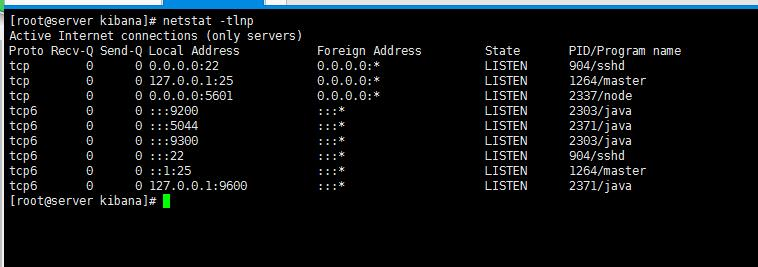
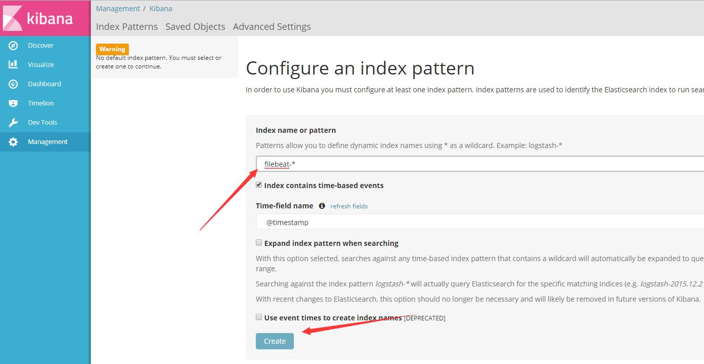
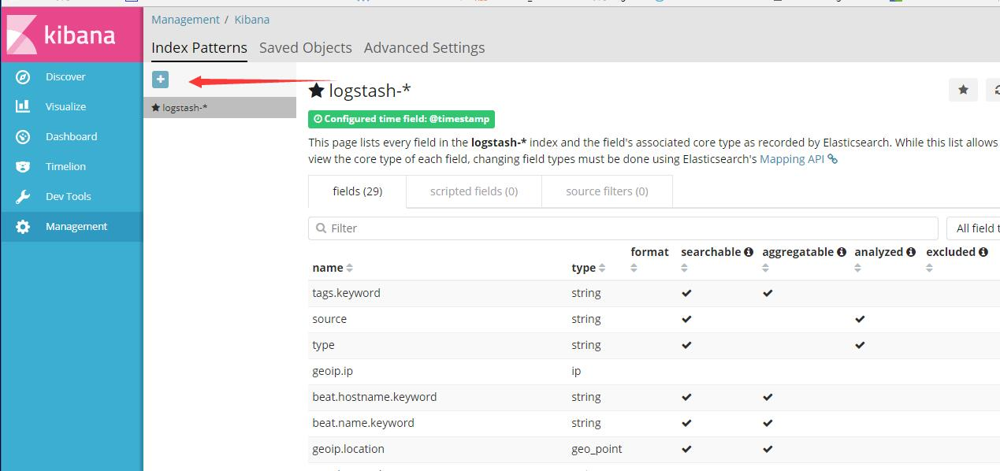
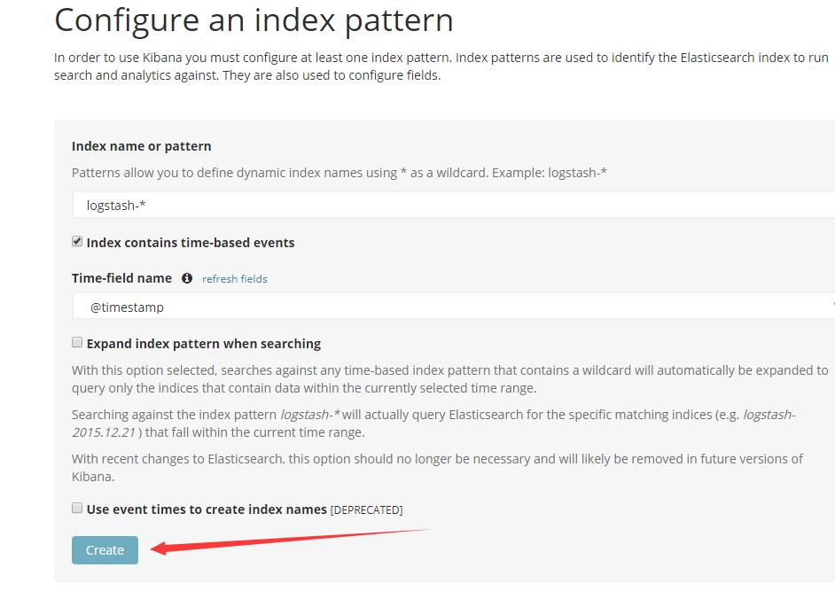

#   简介

Fluentd 和 Elasticsearch都可以做分布式日志，fluentd需要一个数据库进行收集再读取，负载就比较高，Elasticsearch直接将所有的数据收集，再展通过kibana示出来，负载低，速度快。elk还加入了beats插件，不但可以分析日志还可以分析流量、监控服务等。

-	Elasticsearch是个开源分布式搜索引擎，它的特点有：分布式，零配置，自动发现，索引自动分片，索引副本机制，restful风格接口，多数据源，自动搜索负载等。

-	Logstash是一个开源的用于收集,分析和存储日志的工具。
-	Kibana 也是一个开源和免费的工具，Kibana可以为 Logstash 和 ElasticSearch 提供的日志分析友好的 Web 界面，可以汇总、分析和搜索重要数据日志。

-	Beats是elasticsearch公司开源的一款采集系统监控数据的代理agent，是在被监控服务器上以客户端形式运行的数据收集器的统称，可以直接把数据发送给Elasticsearch或者通过Logstash发送给Elasticsearch，然后进行后续的数据分析活动。

>Beats主要有下面三个组件:

1.	Packetbeat：是一个网络数据包分析器，用于监控、收集网络流量信息，Packetbeat嗅探服务器之间的流量，解析应用层协议，并关联到消息的处理，其支 持ICMP (v4 and v6)、DNS、HTTP、Mysql、PostgreSQL、Redis、MongoDB、Memcache等协议；

2.	Filebeat：用于监控、收集服务器日志文件，其已取代 logstash forwarder；

3.	Metricbeat：可定期获取外部系统的监控指标信息，其可以监控、收集Apache、HAProxy、MongoDB、MySQL、Nginx、PostgreSQL、Redis、System、Zookeeper等服务


#   软件环境  

本文主要是分析日志的，所以只需装以下服务，如果有需要监控，再装其他beats插件，方法和装filebeat一样。

##	服务器环境

*    centos7.3   
*    JDK:1.8 
*    Elasticsearch：5.4.*
*    Logstash：5.4 *
*    Kibana：5.4.*
*    Filebeat

##	原理图

具体看ELK体系文档。


##	端口介绍

为了保证服务能够正常运行，要在云平台上开放以下端口。

###	Elasticsearch

>	Elasticsearch有两个端口

9200：收集数据和API访问端口，数据来源有logstash、beats插件等。kibana访问9200端口获取数据。

9300：集群通信端口

###	Kibana

>	Kibana有一个端口

5601：web页面访问端口。

###	Logstash

>	logstash有两个端口

5044：收集数据，数据来源是beats。

9600：数据访问API接口。

#	验证服务器环境

*	server：192.168.254.137

	需要装的服务有：JDK:1.8 ，Elasticsearch：5.4.*，Logstash：5.4 *，Kibana：5.4.*，Filebeat
    
*	note1：192.168.254.135

	需要装的服务有：Filebeat

*	note2：192.168.254.136

	需要装的服务有：Filebeat


# 环境安装

##	jdk安装
    
下载jdk-8u121-linux-x64.rpm包，下载地址：

[http://www.oracle.com/technetwork/java/javase/downloads/jdk8-downloads-2133151.html](http://www.oracle.com/technetwork/java/javase/downloads/jdk8-downloads-2133151.html)


	rpm -ivh jdk-8u121-linux-x64.rpm
    
   
##	配置yum源用rpm包安装elk服务

用rpm包安装很方便，但是权限问题很严重，需要用root用户运行。

>	取得elk的认证

	rpm --import https://artifacts.elastic.co/GPG-KEY-elasticsearch	 
    
>	配置yum源

	vim /etc/yum.repos.d/elasticsearch.repo   
<pre>    
[elasticsearch-5.x]
name=Elasticsearch repository for 5.x packages
baseurl=https://artifacts.elastic.co/packages/5.x/yum
gpgcheck=1
gpgkey=https://artifacts.elastic.co/GPG-KEY-elasticsearch
enabled=1
autorefresh=1
type=rpm-md
 </pre>


###	Elasticsearch

####	安装

	yum install  -y  elasticsearch
    
####	配置


配置文件在/etc/elasticsearch/下面


elasticsearch单个服务可以做出成集群，可能用不到,下面有标注。

	vim	/etc/elasticsearch/elasticsearch.yml
 
```
...
# ---------------------------------- Cluster -----------------------------------
#
# Use a descriptive name for your cluster:
#
cluster.name: tomcat_001					## 集群需要，集群的名字
#
# ------------------------------------ Node ------------------------------------
#
# Use a descriptive name for the node:
#
node.name: linux-node1						##集群需要 节点名字
#
# Add custom attributes to the node:
#
#node.attr.rack: r1
#
# ----------------------------------- Paths ------------------------------------
#
# Path to directory where to store the data (separate multiple locations by comma):
#
path.data: /data/es-data/				##为了防止文件过大，把收集的数据放到其他地方
#
# Path to log files:
#
path.logs: /data/log/elasticsearch/		##日志文件
#
# ----------------------------------- Memory -----------------------------------
#
# Lock the memory on startup:
#
#bootstrap.memory_lock: true		##是否可以使用swap内存

# ---------------------------------- Network -----------------------------------
#
# Set the bind address to a specific IP (IPv4 or IPv6):
#
network.host: 0.0.0.0					##对外侦听的ip
#
# Set a custom port for HTTP:
#
http.port: 9200								##对外侦听的端口
#
# For more information, consult the network module documentation.
#
# --------------------------------- Discovery ----------------------------------
#
# Pass an initial list of hosts to perform discovery when new node is started:
# The default list of hosts is ["127.0.0.1", "[::1]"]
#
#discovery.zen.ping.unicast.hosts: ["192.168.254.137", "192.168.254.135"]		##集群需要，发现集群的ip集合
#
# Prevent the "split brain" by configuring the majority of nodes (total number of master-eligible nodes / 2 + 1):
#
#discovery.zen.minimum_master_nodes: 2	##集群需要，至少有两个及以上的节点才能有master

...
    
```

###	Logstash	

####	安装
	
    yum install -y logstash
    
####	配置

配置文件在/etc/logstash/下面

logstash的配置比较复杂，具体的看使用篇。

       vim /etc/logstash/conf.d/logstash.conf

```
input {
    beats {
        port => "5044"
    }
}
 filter {
    grok {
        match => { "message" => "%{COMBINEDAPACHELOG}"}
    }
}
output {
    elasticsearch {
        hosts => [ "192.168.254.137:9200" ]
    }
}

```

修改日志存放位置

    vim /etc/logstash/logstash.yml
    
```
...
#path.logs: /var/log/logstash
path.logs: /data/log/logstash
...

```


“/etc/logstash/conf.d/”下面是放置“.conf”结尾的logstash配置文件。
如果放置多个“.conf”文件，会将所有文件的内容进行合并，把“input”放到一起，“output放在一起”，官方没有说过这样写，建议只放一个"logstash.conf"文件。

注释：
>	input  数据来源

port => "5044"：对外侦听， filebeat数据通过这个端口发送给logstash。

>	filter	数据处理

"message" => "%{COMBINEDAPACHELOG}"：将数据给”COMBINEDAPACHELOG“进行正则匹配。这个正则可以根据需求进行书写，”COMBINEDAPACHELOG“这个正则是系统自带的，只适合apache日志。

系统自带的正则在这个目录下面
/usr/share/logstash/vendor/bundle/jruby/1.9/gems/logstash-patterns-core-4.1.0/patterns


“=>”也可以用“，”代替，有两种方式表示。

” match => { "message" => "%{COMBINEDAPACHELOG}"} “ 中的"match => { }"也可以用“match =>[]”


>	output	数据输出

hosts => [ "192.168.254.137:9200" ]：把收集到的数据发送给server。


###	Kibana

####	安装
	
    yum install -y kibana
    
####	配置

配置文件在/etc/kibana/

只需要修改以下侦听地址

	vim /etc/kibana/kibana.yml 

```
...

server.host: "192.168.254.137"
...
elasticsearch.url: "http://192.168.254.137:9200"

...

```
注释：

server.host: "192.168.254.137"：web对外侦听地址，我们通过该地址进行访问。

elasticsearch.url: "http://192.168.254.137:9200"：连接elasticsearch的端口和ip。

修改日志位置

    vim /etc/init.d/kibana
    
    
```
  [ ! -d "/data/log/kibana/" ] && mkdir "/data/log/kibana/"
  chown "$user":"$group" "/var/log/kibana/"
  chmod 755 "/data/log/kibana/"


  # Setup any environmental stuff beforehand


  # Run the program!

  chroot --userspec "$user":"$group" "$chroot" sh -c "
    
    cd \"$chdir\"
    exec \"$program\" $args
  " >> /data/log/kibana/kibana.stdout 2>> /data/log/kibana/kibana.stderr &


```


###	filebeat

####	安装

	yum install -y filebeat
    
####	配置

配置文件在/etc/filebeat/下面


filebeat主要作用就是做日志采集的，采集的数据可以发给elasticsearch和logstash。

发给elasticsearch是原始数据，没有经过任何处理。

发给logstash，logstash再发给elasticsearch,经过了处理。

实际上下情况只需要发送一个就够了，只需要发送给logstash。本文发送两个是为了对比logstash处理日志的情况。

修改日志位置，对服务器elasticsearch和logstash的ip和端口

	vim /etc/filebeat/filebeat.yml
    
```
...
filebeat.prospectors:
- input_type: log
 paths:
  - /data/tomcat/logs/*.log    
#==================== Outputs =====================
#------------- Elasticsearch output ---------------
output.elasticsearch:
 # Array of hosts to connect to.
  hosts: ["192.168.254.137:9200"]
#---------------- Logstash output -----------------
output.logstash:
 # The Logstash hosts
 hosts: ["192.168.254.137:5044"] 
 ...
 
```

修改filebeat日志文件位置

    vim /etc/filebeat/filebeat.full.yml
    
```
...
logging.to_files: true
logging.files:
  #path: /var/log/filebeat
  path: /data/log/filebeat
...


```


#	服务启动与关闭

##	启动
	
	systemctl start elasticsearch
	systemctl start logstash
	systemctl start kibana
	systemctl start filebeat
    
###	启动时可能会出现的问题

1.	can not run elasticsearch as root

解决：新建一个专门运行和管理elasticsearch 的用户。

2.	max file descriptors [65535] for elasticsearch process is too low, increase to at least [65536]

解决：切换到root用户，编辑limits.conf 添加类似如下内容

	vim  /etc/security/limits.conf

修改文件末尾如下内容:

```
* soft nofile 655350
* hard nofile 655350
```

然后切换回用户，使用ulimit -Ha 查看是否已经更改(对应的是open file 选项)

3.	max virtual memory areas vm.max_map_count [65530] is too low, increase to at least [262144]

解决：root用户修改配置sysctl.conf

	vim /etc/sysctl.conf

添加下面配置：

```
vm.max_map_count=655300
```

并执行命令：
	
    sysctl -p

再重新运行 ElasticSearch

##	开启启动

	systemctl enable elasticsearch
	systemctl enable logstash
	systemctl enable kibana
	systemctl enable filebeat

	
##	查看状态

	systemctl status elasticsearch
	systemctl status logstash
	systemctl status kibana
	systemctl status filebeat
    
##  查看进程

centos7系统不自带“netstat”命令，取而代之的是“ss”,后面接的参数是一样的。
还是习惯用“netstat”这个命令，因为看起来更加直观。

安装“netstat”命令

	yum install -y net-tools
    
查看进程方法：

	netstat  -tlnp
    


其中“9200”和“9300”是elasticsearch服务端口
“5601”是kibana端口
“5044”和“9600”是logstash端口

只要有上图的端口就说明启动成功了。


##	停止
	
	systemctl stop elasticsearch
	systemctl stop logstash
	systemctl stop kibana
	systemctl stop filebeat
    

#	用源码包安装elk服务

这种方式安装可以更加方便管理，用一个新建的devop用户就可以启动所有服务。

elk二进制包下载地址：


切换用户

	su -  devop

>	解压


	tar -xf elasticsearch-5.4.2.tar.gz 
	tar -xf filebeat-5.4.2-linux-x86_64.tar.gz 
	tar -xf kibana-5.4.2-linux-x86_64.tar.gz 
	tar -xf logstash-5.4.2.tar.gz 

>	移动

	mv elasticsearch-5.4.2.tar.gz  /data/local/elasticsearch
	mv kibana-5.4.2-linux-x86_64.tar.gz   /data/local/kibana
	mv  filebeat-5.4.2-linux-x86_64.tar.gz /data/local/filebeat
	mv   logstash-5.4.2.tar.gz  /data/local/logstash
    
>	修改配置

配置方式和上面是一样的，对照修改。

	vim  /data/local/elasticsearch/config/elasticsearch.yml
    
    vim	/data/local/kibana//config/kibana.yml
   
    vim  /data/local/filebeat/filebeat.yml
    
    vim  /data/local/logstash/filebeat.yml
    
    
    
>	启动

进入到相对应的目录

	nohup ./bin/elasticsearch &

	nohup ./bin/kibana &
   
    nohup ./bin/logstash -f logstash.conf &
    
	nohup ./filebeat -e -c filebeat.yml &


#   Kibana基础配置

给elasticsearch发送数据的插件相对于kibana来说都是索引

kibana没有自动添加功能，我们需要手动添加。

1. 	打开http://192.168.254.137:5601

2.	创建索引

>   创建filebeat的索引

filebeat索引是原始数据，如果没有数据输出没有指向elasticsearch，就不用添加。

只需输入filebeat-* 




>	创建logstash的索引

紧接上一步，然后点击“+”,再点击“Create”按钮创建logstash索引  。






#	参考文档

elk官方文档:

[https://www.elastic.co/guide/cn/index.html?elektra=home&storm=banner&iesrc=ctrl](https://www.elastic.co/guide/cn/index.html?elektra=home&storm=banner&iesrc=ctr)

第三方文档：

[http://www.tuicool.com/articles/ARfQRfE](http://www.tuicool.com/articles/ARfQRfE)

[http://www.cnblogs.com/yincheng/p/logstash.html](http://www.cnblogs.com/yincheng/p/logstash.html)

