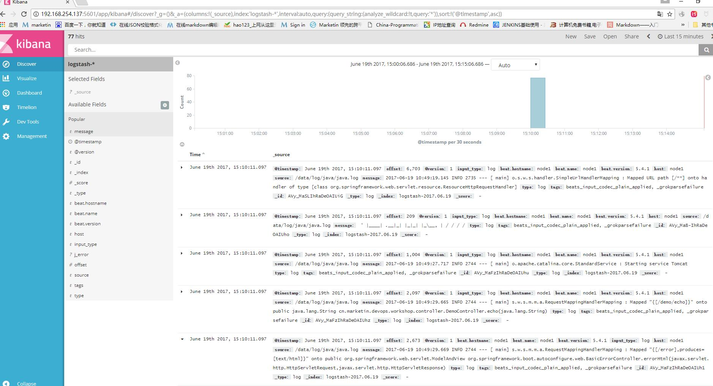
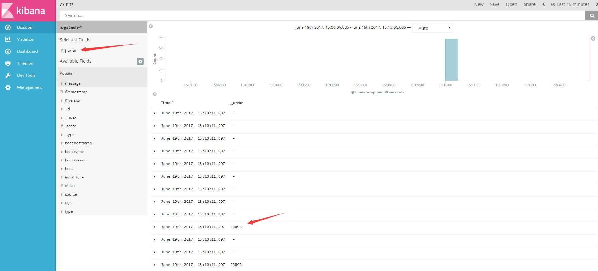
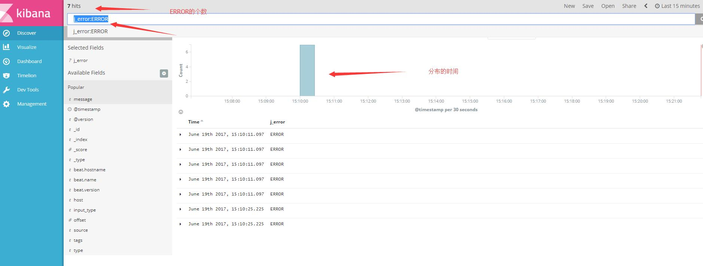
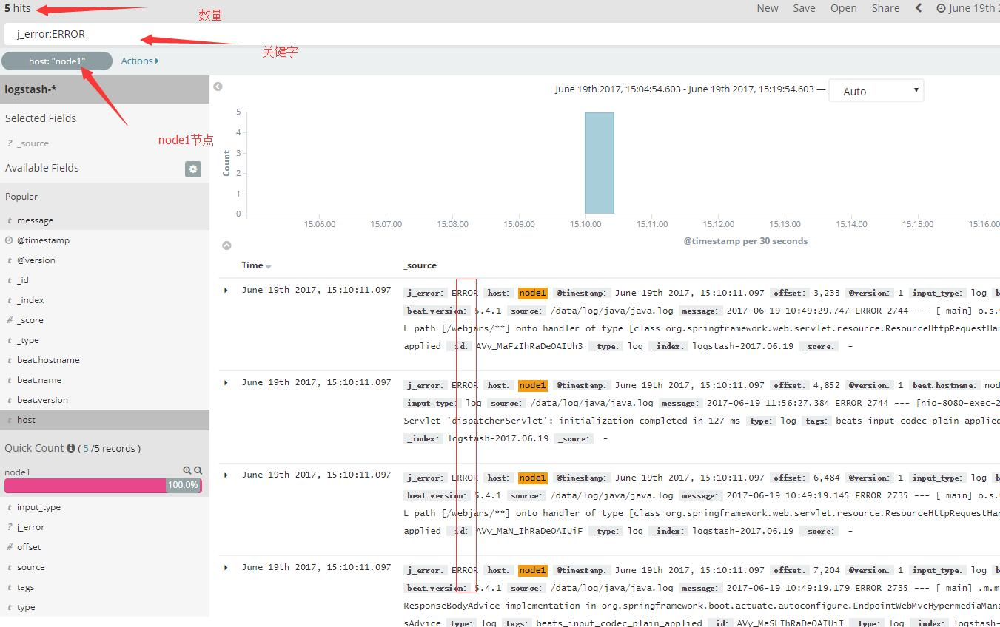

#   elk使用

主要是两个方面的使用，一个是Logstash使用，一个是页面的查看。
logstash的功能比较强大，配置方法比较复杂，下面以例子来解释。

#	实验环境

server：192.168.254.137

node1: 192.168.254.135

node2: 192.168.254.136

#	实例：查询某台机器error数量及分布时间

##	配置filbeat

指定被分析的日志

>	下面是在node1,node2节点上配置：

	vim /etc/filebeat/filebeat.yml

```
...

- input_type: log

  # Paths that should be crawled and fetched. Glob based paths.
  paths:
    - /data/log/java/*.log
...    
```


##	配置logstash

>	下面是在server上配置

####	定义正则

grok截取日志都是要用正则匹配的，系统默认自带了很多正则，在/usr/share/logstash/vendor/bundle/jruby/1.9/gems/logstash-patterns-core-4.1.0/patterns目录下面

我们可以直接再该目录下面加文件定义正则。

也可以用下面方式定义正则文件。

	mkdir /data/patterns
    
    cd  /data/patterns	
    
    vim java
    
>	添加下面这一句话
```
JERROR ERROR
```

注释：
“JERROR”是我们定义的正则名字，在后面logstash的配置文件里面可以进行使用。
“ERROR”是我们定义的正则匹配方式，可以按照需求进行书写。
如果需要多个正则，另起一行，再书写。


###	修改配置文件

	vim /etc/logstash/conf.d/logstash.conf

```
input {
    beats {
        port => "5044"
    }
}
 filter {
    grok {
        patterns_dir => "/data/patterns"
        match => [ "message","%{JERROR:j_error}"]
    }
}
output {
    elasticsearch {
        hosts => [ "192.168.254,137:9200" ]
    }
}

```


注释:

patterns_dir => "/data/patterns"：是指定正则文件的位置，如果不写，就是系统默认位置。

“message”是系统定义的关键字，里面包含日志文件一行的所有内容。patterms_dir是指定正则规定的地方，"%{JERROR:j_error}"截取正则，并将其重新赋值为j_error.

“match”是一个hash类型，默认是空，当我们匹配到合适的正则后就会将其以键值的方式对应。


详情看备注。

###	重启服务

	systemctl  restart logstash
    systemctl  restart filebeat
    

##	查看

>	http://192.168.254.137:5601



>点击我们新加的关键字j_error



可以看到ERROR的大致情况

>再看看具体的情况及分布时间

再最上面的输入栏中输入j_error:ERROR




>	查看node1服务器上面的ERROR数量

点击node1节点


查看数据分布




大体上的情况就已经知道了。

如果需要查其他的关键字信息，直接写正则就可以了。


#	数据清理

为了时效性，需要删除一些过时的数据

用API删除

>	删除logstash索引2017.06.21号的所有数据

	curl -XDELETE  'http://127.0.0.1:9200/logstash-2017.06.19*'

>	删除logstash索引2017.06月所有数据

	curl -XDELETE  'http://127.0.0.1:9200/logstash-2017.06*'
   
>	清除60天之前的所有数据

  
为了方便，写成计划任务
 
	crontab -e
    
```
0 2 6 * * sh /data/scripts/clear_es_date.sh 

```
 
脚本内容，已经提交到git
 
	vim  /data/scripts/clear_es_date.sh 

```
#!/bin/bash
_last_data=`date -d '-2 months' +%Y.%m`
curl -XDELETE 'http://127.0.0.1:9200/*-'${_last_data}'-*'

```
 
#	备注


##	Logstash的使用


	   Logstash配置    

       vim /etc/logstash/conf.d/logstash.conf

<pre>
input {
    beats {
        port => "5043"
    }
}
 filter {
    grok {
        match => { "message" => "%{COMBINEDAPACHELOG}"}
    }
    geoip {
        source => "192.168.254.137"
    }
}
output {
    elasticsearch {
        hosts => [ "192.168.254.137:9200" ]
    }
}
</pre>

注释：
-	input:	输入方式有多种，我们一般用的是这两种：一种是安装beats插件，如上。还有一种是按照文件读取

<pre>
input {
    file {
        path => "/data/tomcat/logs/*.log"
        start_position => "beginning"
    }
}
</pre>

-	filter:将日志数据进行整理过滤，里面有好多关键字：

1.	grok：
目前是logstash中把非标准化的日志数据转换成标准化并且可搜索数据最好的方式。Logstash默认提供了能分析包括java堆栈日志、apache日志在内的120种形式。[更多格式](https://github.com/logstash-plugins/logstash-patterns-core/tree/master/patterns)

<pre>
grok{       
    match => {"message" => ["%{COMBINEDAPACHELOG}"]}        
}
</pre>

但如果想要监控更多的信息，比如url上的参数，那么默认的表达式将没办法满足我们的需求，这时我们就需要自己动手去编写一些符合我们业务需要的表达式，并告诉logstash以某种期望的方式进行数据转换。

首先，在logstash的根目录下创建一个patterns文件夹，这个文件夹默认是没有的。

其次，在patterns文件夹中创建文件test_pattern（这里为了方便所以没有按照pattern的功能对文件进行命名，在实际应用中最好按照功能来对文件命名）。在test_pattern文件中可以按照“名称 正则表达式”这样的格式自定义一些正则表达式，以便在grok中进行使用。

最后，在使用的时候一定要把pattern_dir这个参数带上，否则logstash无法识别你自定义的这些正则表达

<pre>
grok {
    patterns_dir => ["/home/keepgostudio/download/logstash-5.2.0/patterns"]
    match => {
        "message" => ["%{PARAMS_APACHELOG}", "%{NO_PARAMS_APACHELOG}"]
    }
    remove_field => ["host", "timestamp", "httpversion", "@version"]
}
</pre>

2.	kv：

将数据源转换成键值对，并创建相对的field。比如传入“a=111&b=2222&c=3333”，输出的时候，a，b，c会被创建成三个field，这样做的好处是，当需要查询某一个参数的时候可直接查询，而不是把一个字符串搜索出来再做解析。

<pre>
kv {
    source => "field_name"
    field_split => "&?"
}
</pre>

3.	geoip:

这个从字面上就能看出他的功能，根据ip查出相应的地理信息，比如城市，省份，国家，经纬度等。这个ip信息是在logstash中的一个数据源中进行搜索查找，而不是进行网络搜索。

<pre>
geoip {
    source => "field_name"
    fields => ["country_name", "region_name", "city_name", "latitude", "longitude"]
    target => "location"
}
</pre>

4.	drop:

drop可以跳过某些不想统计的日志信息，当某条日志信息符合if规则时，该条信息则不会在out中出现，logstash将直接进行下一条日志的解析。

<pre>

if [field_name] == "value" {
    drop {}
}

</pre>

5.mutate

字段处理

添加一个“logstash_node”字段

<pre>

filter {
    grok {
        match => [ "message","%{LOGLEVEL:Level}"  "%{ERROR:error}" ]
    }
    mutate  {
        add_field => { "logstash_node" => "logstash_1"}
    }
}
</pre>


-	output:

logstash输出到elasticsearch的ip及端口


>   关于ELK Stack的一些查询语句: 

在日志服务器上面执行

①查询filebeat

	curl -XGET 'http://localhost:9200/filebeat-*/_search?pretty'
    
②查询packetbeat

	curl -XGET 'http://localhost:9200/packetbeat-*/_search?pretty'

③查询metricbeat

	curl -XGET 'http://localhost:9200/metricbeat-*/_search?pretty'
    
④查询集群健康度

	curl 'localhost:9200/_cat/health?v'
    
⑤查看节点列表

	curl 'localhost:9200/_cat/nodes?v'

⑥列出所有索引

	curl 'localhost:9200/_cat/indices?v'


#	参考文档

elk官方文档:

[https://www.elastic.co/guide/cn/index.html?elektra=home&storm=banner&iesrc=ctrl](https://www.elastic.co/guide/cn/index.html?elektra=home&storm=banner&iesrc=ctr)

第三方文档：

[http://www.tuicool.com/articles/ARfQRfE](http://www.tuicool.com/articles/ARfQRfE)

[http://www.cnblogs.com/yincheng/p/logstash.html](http://www.cnblogs.com/yincheng/p/logstash.html)
