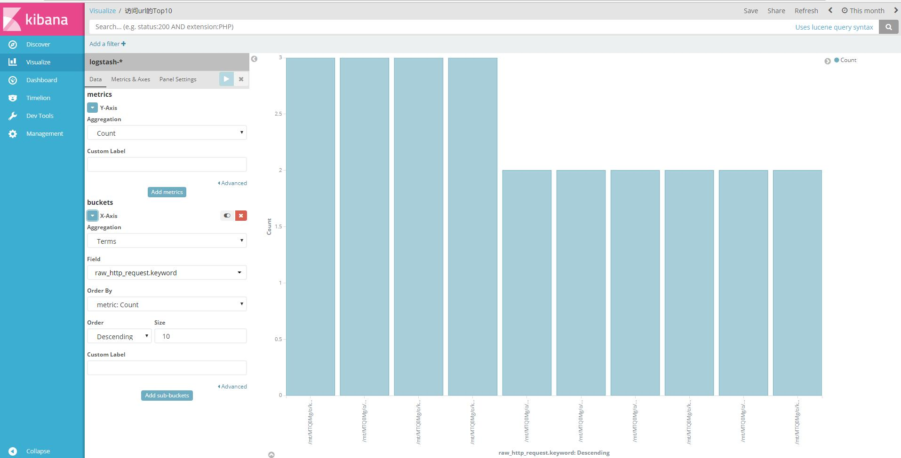

#	简介

通过elk日志系统可视化分析access.log包括：

*	访问来源的情况（地域分布）
*	访问URL的情况（URL的TopN）
*	访问URL的处理耗时时间情况（响应时间）
*	访问URL的返回状态码分布情况（200/404/403/500/..）

#	配置

##	日志格式

Nginx在SLB后端，实际Client的IP在行尾部。
<pre>
100.109.226.53 - - [07/Sep/2017:20:01:32 +0800] "GET /mt/MTQ0Mg/c/k=,c=,u=,p=,c1=,o=1,i=,m=,i1=07E5BC62838C38DEEC37ADC30386C133,o1=,a=,a1=,i2=180.164.113.237,t=1504785676523,o2=,t1=,a2=1088720922,a3=IOS-BB% HTTP/1.0" 400 0 "-" "Mozilla/5.0 (iPhone; CPU iPhone OS 10_3_3 like Mac OS X) AppleWebKit/603.3.8 (KHTML, like Gecko) Version/10.0 Mobile/14G60 Safari/602.1" "180.164.113.237"
100.109.226.33 - - [07/Sep/2017:20:31:24 +0800] "GET /mt/MTQ0Mg/c/k=,c=,u=,p=,c1=,o=0,i=41237B837546C70CCC3BD577F7F3962A,m=,i1=,o1=,a=,a1=,i2=175.9.219.90,t=1504787467669,o2=,t1=,a2=com.lemon.play.freecell,a3=% HTTP/1.0" 400 0 "-" "Mozilla/5.0 (Linux; U; Android 5.1.1; zh-cn; Redmi 3 Build/LMY47V) AppleWebKit/537.36 (KHTML, like Gecko) Version/4.0 Chrome/53.0.2785.146 Mobile Safari/537.36 XiaoMi/MiuiBrowser/9.1.3" "175.9.219.90"
100.109.226.21 - - [07/Sep/2017:21:01:21 +0800] "GET /mt/MTQ0Mg/c/k=,c=,u=,p=,c1=,o=0,i=5F3AA073E48F38D352848B7A9F111A84,m=,i1=,o1=,a=,a1=,i2=223.88.130.40,t=1504789277451,o2=,t1=,a2=com.adsmobile.mrzd,a3=banner%20%20% HTTP/1.0" 400 0 "-" "Mozilla/5.0 (Linux; U; Android 5.1.1; zh-cn; 2014811 Build/LMY47V) AppleWebKit/537.36 (KHTML, like Gecko) Version/4.0 Chrome/53.0.2785.146 Mobile Safari/537.36 XiaoMi/MiuiBrowser/9.0.3" "223.88.130.40"
100.97.62.60 - - [07/Sep/2017:21:31:38 +0800] "GET /mt/MTQ0Mg/c/k=,c=,u=,p=,c1=,o=0,i=DF8D05CD73E1D505A2E231003A702613,m=,i1=,o1=,a=,a1=,i2=117.177.141.219,t=1504791062844,o2=,t1=,a2=com.lemon.play.doudizhu,a3=% HTTP/1.0" 400 0 "http://c.bid.ljrtb.cn/?x=9&id=5c896904-015e-1000-e8e5-01c7298c00b7&g=20625&c=208062&rnd=1995041903&slot=1&cpg=5091&cmp=214&ab=1&d=IPUAMD5_DB79835FF447423AAD99E5FB48E99B26&didt=60&r=100&m=com.lemon.play.doudizhu&o=1&dt=1&ge=328&cr=43&md=0&mc=164&la=32.443&lo=105.867&ct=1&cur=1&ip=117.177.141.219&ta=&di=&pt=1&crt=1_101&cg=0&st=0&cot=3&cpr=&w=640&h=100&osp=2000000&srp=2000000&bfp=65909&an=&ua=&cmi=&olta=&cai=100017_100152&url=http%3a%2f%2ftr.wa.limei.com%2fmt%2fMTQ0Mg%2fc%2fk%3d%2cc%3d%2cu%3d%2cp%3d%2cc1%3d%2co%3d0%2ci%3dDF8D05CD73E1D505A2E231003A702613%2cm%3d%2ci1%3d%2co1%3d%2ca%3d%2ca1%3d%2ci2%3d117.177.141.219%2ct%3d1504791062844%2co2%3d%2ct1%3d%2ca2%3dcom.lemon.play.doudizhu%2ca3%3d%25" "Mozilla/5.0 (Linux; U; Android 6.0.1; zh-cn; OPPO R9s Build/MMB29M) AppleWebKit/537.36 (KHTML, like Gecko)Version/4.0 Chrome/37.0.0.0 MQQBrowser/7.2 Mobile Safari/537.36" "140.207.185.107"
</pre>

Nginx直接公网访问，行首为Client的IP

<pre>
140.205.225.189 - - [12/Sep/2017:16:51:15 +0800] "POST / HTTP/1.1" 405 575 "http://120.26.121.86/" "Mozilla/4.0 (compatible; MSIE 6.0; Windows NT 5.1;Alibaba.Security.Heimdall.5448812)" "-"
47.90.92.26 - - [12/Sep/2017:16:51:50 +0800] "GET / HTTP/1.1" 200 9 "-" "-" "-"
140.205.225.189 - - [12/Sep/2017:16:51:54 +0800] "POST /struts2-showcase/integration/saveGangster.action HTTP/1.1" 404 22 "http://120.26.121.86/" "Mozilla/4.0 (compatible; MSIE 6.0; Windows NT 5.1;Alibaba.Security.Heimdall.5448812)" "-"
140.205.225.189 - - [12/Sep/2017:16:59:24 +0800] "GET /clusters.jsf HTTP/1.1" 404 22 "http://120.26.121.86/" "Mozilla/4.0 (compatible; MSIE 6.0; Windows NT 5.1;Alibaba.Security.Heimdall.5448812)" "-"
</pre>

##	编写正则

找到logstash自带的正则目录，不同的版本位置不同

	vim  /usr/share/logstash/vendor/bundle/jruby/1.9/gems/logstash-patterns-core-4.1.1/patterns/web

根据日志格式编写
<pre>
IP2  (?:(?:%{IP}),\s+(?:%{IP}))
PROXYIP (?:%{IP}|%{IP2}|(?:\-))
WEB %{IPORHOST:clientip} (?:%{NUMBER:pip}|-) (?:%{NUMBER:cip}|-) \[%{HTTPDATE:log_date}\] \"%{WORD:http_verb} (?:%{PATH:baseurl}\?%{NOTSPACE:params}(?: HTTP/%{NUMBER:http_version})?|%{DATA:raw_http_request})\" %{NUMBER:http_status_code} (?:%{NUMBER:bytes_read}|-) %{QS:referrer} %{QS:agent} \"%{IPORHOST:vip}\"
</pre>

字段注释：

*	Vip：代理ip
*	pip：日志里面为空时就不显示，nginx日志规定是代理ip
*	cip：日志里面为空时就不显示，Nginx日志规定是客户端ip
*	log_date：日志时间
*	http_verb：请求类型
*	baseurl：url地址
*	params/http_version：http协议类型
*	raw_http_request:完整的url地址
*	http_status_code：url状态码
*	bytes_read：数据量
*	referrer：来源
*	agent：代理端
*	clientip：客户端ip

##	下载ip数据包

ip数据包是为了能够在页面上看到用户分布，需要每个星期更新一次

	wget http://geolite.maxmind.com/download/geoip/database/GeoLite2-City.tar.gz

	tar -xf GeoLite2-City.tar.gz

	cd GeoLite2-City_20170905 

	cp GeoLite2-City.mmdb /etc/logstash/

下载es对应的json格式

	curl -O https://gist.githubusercontent.com/thisismitch/3429023e8438cc25b86c/raw/d8c479e2a1adcea8b1fe86570e42abab0f10f364/filebeat-index-template.json

导入

	curl -XPUT 'http://localhost:9200/_template/filebeat?pretty' -d@filebeat-index-template.json

##	filebeat配置

为了将日志做区分，需要添加一个关键字

我们所有采集的日志都需要做区分，安类型区分如：nginx_log,system_log,api_access_log等，方便后面logstash进行数据处理

定义的关键字为：“log_type”

	vim /etc/filebeat/filebeat.yml

<pre>
 input_type: log

  # Paths that should be crawled and fetched. Glob based paths.
  paths:
    - /data/log/*.400
  fields:
      log_type: nginx_log
  fields_under_root: true

</pre>

##	logstash配置

	vim /etc/logstash/conf.d/logstash.conf

因为logstash在做正则截取时，非常消耗内存，有的日志可以不需要进行匹配,可以通过if进行判断

<pre>
input {
    beats {
        port => "5044"
    }
}
filter {
if [log_type] == "nginx_log" {
    grok {
        match => { "message"=>"%{WEB}"}
    }
 geoip {
      source => "clientip"
      target => "geoip"
      database => "/etc/logstash/GeoLite2-City.mmdb"
      add_field => [ "[geoip][coordinates]", "%{[geoip][longitude]}" ]
      add_field => [ "[geoip][coordinates]", "%{[geoip][latitude]}"  ]
    }
    mutate {
      convert => [ "[geoip][coordinates]", "float"]
    }
}

if [log_type] == "system_log" {
...
}
}
output {
    elasticsearch {
        hosts => [ "localhost:9200" ]
    }
</pre>

重启logstash

#	添加视图

##	地域分布

选择视图类型

变量添加

并点击上面的“save”保存

##	url分布

##	访问url的状态

##  ...

##	将视图添加到dashboard

