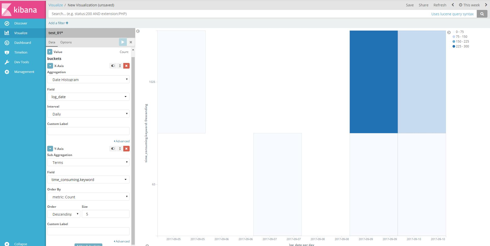

#	简介

系统访问外部API日志分析，包括：

*	访问频次
*	调用状态
*	耗时

#	配置

##	日志格式

|请求时间|返回状态码|耗时（毫秒）|请求类型|请求地址|

<pre>
2017-09-08T16:44:46 200 63 POST http://hotfix.marketin.cn/ads-api/v1/ops/order/10003 
2017-09-08T16:44:52 200 1026 POST http://test.zhiziyun.com/api-marketin/api/ops/order/sBDiF06y3O8 
</pre>

##	编写正则

找到logstash自带的正则目录，不同的版本位置不同

	vim  /usr/share/logstash/vendor/bundle/jruby/1.9/gems/logstash-patterns-core-4.1.1/patterns/web

<pre>
APIURL [a-zA-z]+://[^\s]*
APITIME \d{4}-\d{2}-\d{2}\T\d{2}:\d{2}:\d{2}

API_ACCESS %{APITIME:log_date} %{NUMBER:http_status_code} %{NUMBER:time_consuming} %{WORD:http_verb} %{APIURL:api_url}

</pre>

##	logstash配置

	vim /etc/logstash/conf.d/logstash.conf

<pre>
input {
    beats {
        port => "5044"
    }
}
filter {

if [env] == "test_01" {
   grok {
        match => { "message"=>"%{API_ACCESS}"}
    }

...
    }
 
output {
    elasticsearch {
        hosts => [ "localhost:9200" ]
        manage_template => false
        index => "%{env}-%{+YYYY.MM.dd}"
    }
}
</pre>

#	添加视图

具体操作见access-log_analysis.md

##	访问次数

##	调用状态

##	耗时

耗时的数据个数比较多，可以使用点状图

由于数据比较少，点比较大

