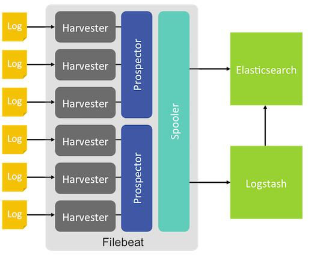

#	简介

filebeat是elk系统的数据采集单元，使用go语言写的。logstash也可以做数据采集，但是logstash对系统的内存、cpu、io等资源消耗比较高，相比较logstash这些消耗的资源可以忽略。

filebeat数据采集是实时的，可以监控多个日志文件（文件夹），只要有数据添加，就会发送到es，再通过kabana就可以看到，响应时间都是在一秒以内。

#	原理图

spooler：数据缓存、处理和发送。

prospector：监控日志路径，有几个文件夹就有几个prospector。

harvester：按行读取日志内容并转发到prospector。

#  工作流程

当Filebeat启动时，它会启动一个或者多个prospector监控日志路径或日志文件，每个日志文件会有一个对应的harvester，harvester按行读取日志内容并转发至prospector。Filebeat维护一个记录文件读取信息的注册文件，记录每个harvester最后读取位置的偏移量，保证不会发送重复的数据。

