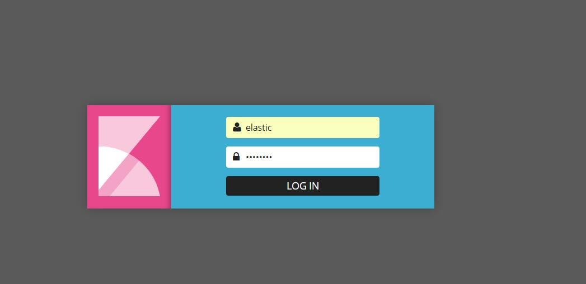
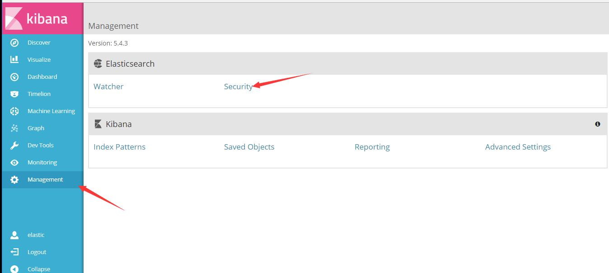
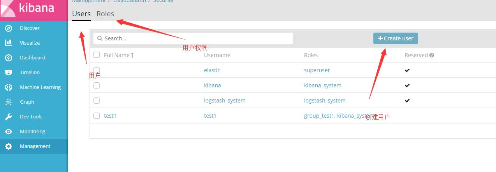
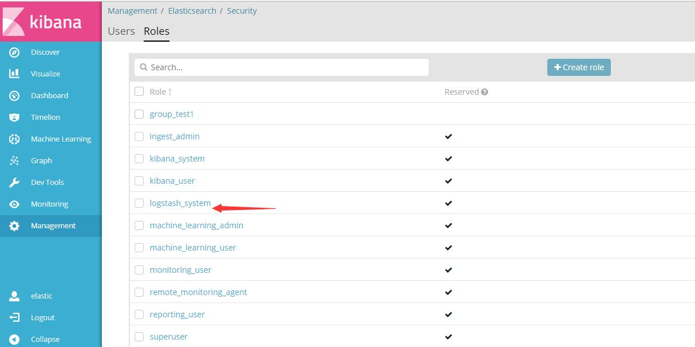
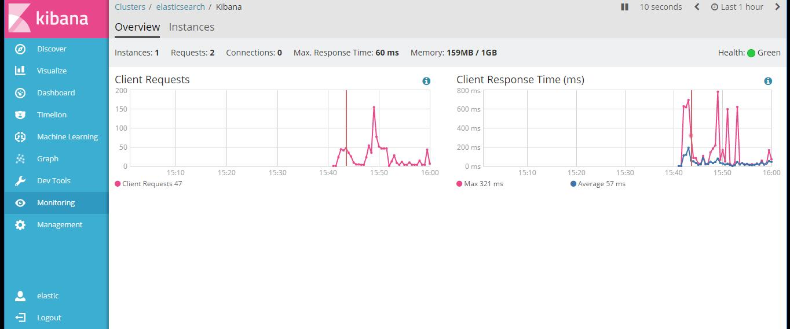
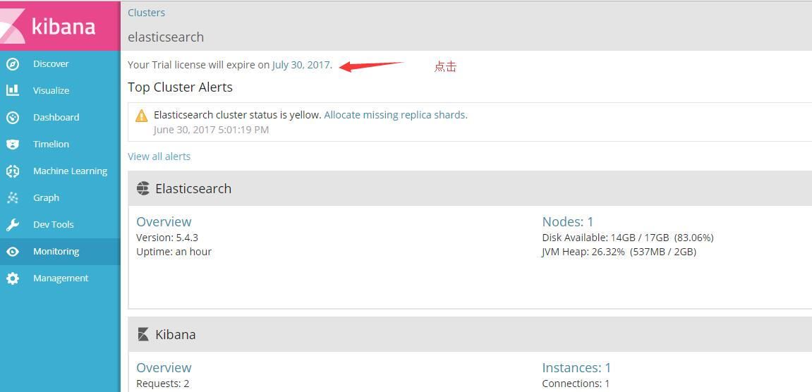
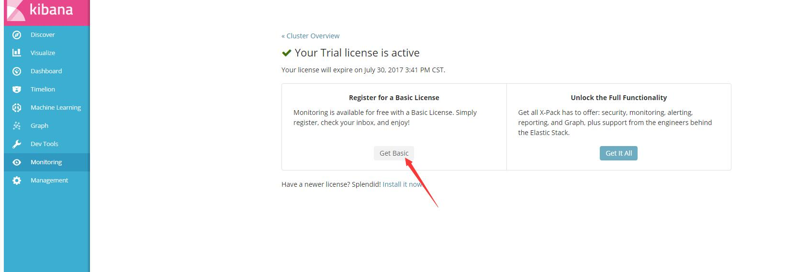
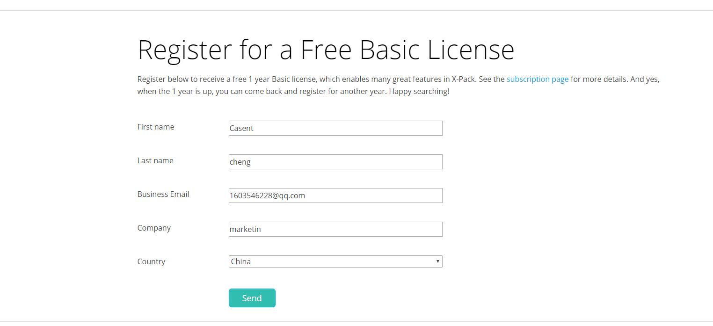
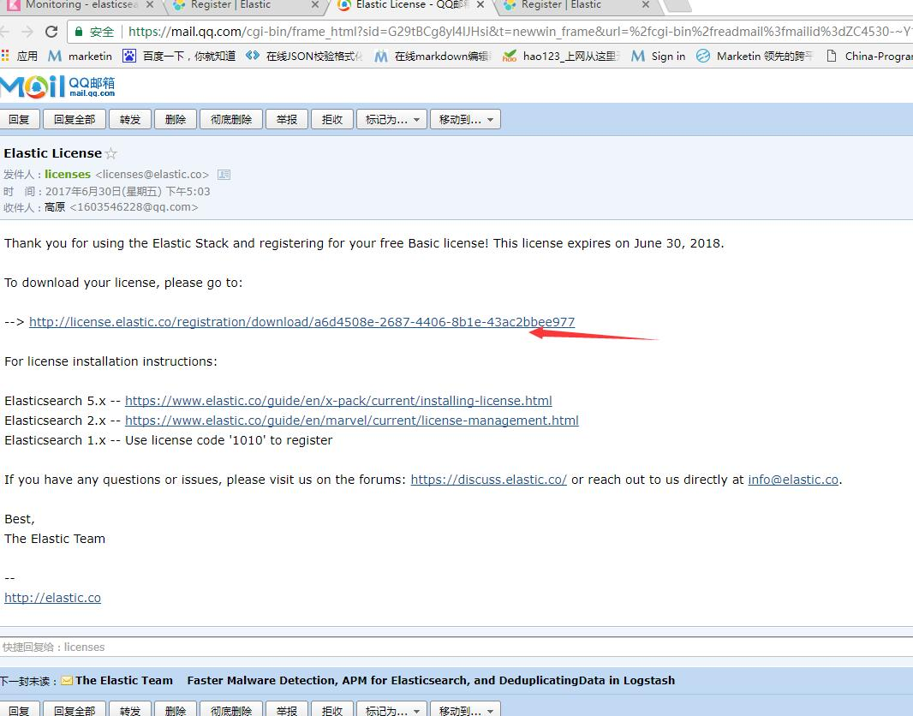
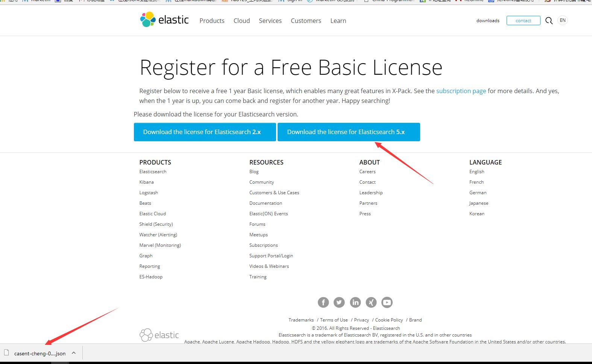

#	简介

为解决elk用户权限捆绑和服务监控的问题，我们可以安装x-pack插件，该插件能够很好的解决这两个问题。

#	安装

>	安装x-pack

Elasticsearh安装x-pack（如果是集群，每台机器上都要安装）

	cd /usr/share/elasticsearch/
    bin/elasticsearch-plugin install x-pack
    
再按两次“y”

Kibana安装x-pack

	cd /usr/share/kibana/
    bin/kibana-plugin install x-pack
    
logstash安装x-pack

	cd /usr/share/logstash/
    bin/logstash-plugin  install x-pack

    
#	使用

x-pack安装好后启动后就可以访问了，有一个超级用“elastic”,密码是“changeme”,有所有权限。




##  修改配置


如果密码有修改需要修改配置文件里的密码

修改kibana配置

    vim kibans.yml
    
```
...
elasticsearch.username: “elastic” 
elasticsearch.password: “changeme”
...
```
修改logstash配置

    vim /etc/logstash/conf.d/logstash.conf
    
```
...
output {
    elasticsearch {
       hosts => ["http://localhost:9200"]
       user => elastic
       password => changeme
}
...
```
    
    vim /etc/logstash/logstash.yml
    
```
......
xpack.monitoring.elasticsearch.url: "http://localhost:9200"
xpack.monitoring.elasticsearch.username: "elastic"
xpack.monitoring.elasticsearch.password: "changeme"
```

##	权限使用

可以在web页面上添加用户和权限组，也可以用API。

名词解释：

users：创建的用户名字

roles：用户被分到哪个role组就有哪些权限，权限就是通过role进行控制


###	在web页面添加修改用户





系统自带了很多权限组，可以点击查看自带的组有哪些权限。



如果我们需要新加一个用户，可以把他放到 “superuser”组。


###	API添加修改用户

>	修改超级用户的密码


curl -XPUT -u elastic 'localhost:9200/_xpack/security/user/elastic/_password' -H "Content-Type: application/json" -d '{ "password" : "123456"}'

>	修改普通用户密码

curl -XPUT -u elastic 'localhost:9200/_xpack/security/user/kibana/_password' -H "Content-Type: application/json" -d '{ "password" : "123456"}'

>	创建role

curl -XPOST -u elastic 'localhost:9200/_xpack/security/role/events_admin' -H "Content-Type: application/json" -d '{
  "indices" : [
    {
      "names" : [ "events*" ],
      "privileges" : [ "all" ]
    },
    {
      "names" : [ ".kibana*" ],
      "privileges" : [ "manage", "read", "index" ]
    }
  ]
}'


>	创建user

curl -XPOST -u elastic 'localhost:9200/_xpack/security/user/johndoe' -H "Content-Type: application/json" -d '{
  "password" : "userpassword",
  "full_name" : "John Doe",
  "email" : "john.doe@anony.mous",
  "roles" : [ "events_admin" ]
}'

##	监控

###	查看

当我们安装好x-pack之后，x-pack插件就会定时采集监控数据到web页面，并提供了可视化图片。

可以直观的看到数据，缺点就是不能发邮件报警。





##	将x-pack升级为永久免费











再更新证书

curl -XPUT -u elastic 'http://localhost:9200/_xpack/license' -H "Content-Type: application/json" -d @casent-cheng-0d5aef40-c59f-4575-a7a1-7fcda571cb29-v5.json

curl -XPUT -u elastic 'http://localhost:9200/_xpack/license?acknowledge=true' -H "Content-Type: application/json" -d @casent-cheng-0d5aef40-c59f-4575-a7a1-7fcda571cb29-v5.json

每年要更新一次。


#   参考文档

官方文档：

[https://www.elastic.co/guide/en/x-pack/current/installing-xpack.html](https://www.elastic.co/guide/en/x-pack/current/installing-xpack.html)
